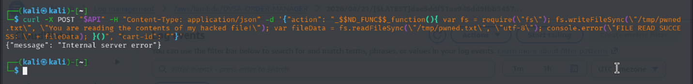
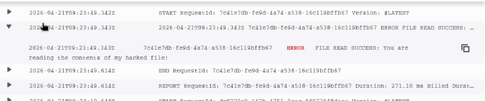
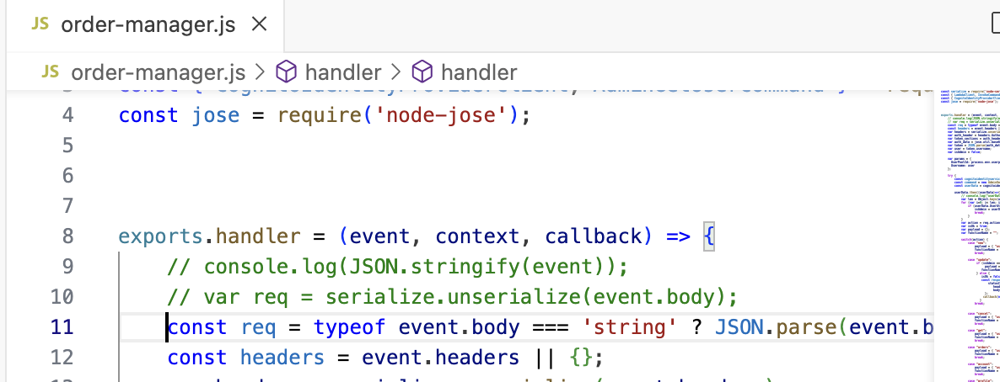

# Lesson #1: Event Injection

## Part 1) Goal and Vulnerability Summary

Insecure de-serialization, which means converting data (e.g. JSON) into objects that the application can understand, becomes the entry point the attacker can use. This means that the API GW trust user’s (the attacker in this case) data too much. As a result, the API doesn’t validate the data before converting them to objects. This could lead to revealing other user’s info when the attacker impersonates them, or even worse escalating normal user to admin and act with its privileges.

## Part 2) Why This Works / Root Cause

It works because the Node.js code uses an outdated node-serialize library which has a known  vulnerability. When the payload contains special function marker  (e.g. _$$_ND_FUNC_function{}()), the serialize.unserialize() method treats it as executable code rather than plain text. Because of that, the payload gets executed immediately when deserialized on the backend server.

This is the outdated library usage in the code.

var req = serialize.unserialize(event.body);

var headers = serialize.unserialize(event.headers);

## Part 3) Environment and Setup

This attack will need the following:

The API GW URL

Curl command line tool

Preparing the CloudWatch application to see the sent message

## Part 4) Reproduction Steps

Loging to the aws web console

Go to API Gateway & search for Stages (in the left panel) & copy the invoked URL (https://k1g7d8le1g.execute-api.us-east-1.amazonaws.com/Stage/order ) the id k1g7d8le1g will be different for each user

Run curl in the command line

curl -X POST ”[YOUR˙API˙GATEWAY˙URL]” “

-H ”Content-Type: application/json” “

-d ’–”action”: ”˙$$ND˙FUNC$$˙function()– var fs = require(“”fs“”); fs.writeFileSync(“”/tmp/pwned.txt

“”, “”You are reading the contents of my hacked file!“”); var fileData = fs.readFileSync(“”/tmp/

pwned.txt“”, “”utf-8“”); console.error(“”FILE READ SUCCESS: “” + fileData); ˝()”, ”cart-id”:””˝’

## Part 5) Evidence and Proof

*Figure 1. CloudWatch evidence showing the injected event payload executed successfully in the backend Lambda.*

## Part 6) Fix Strategy / Probable Mitigation

Secure deserialization function should be used like json.parse() instead of the old library currently in use. The detailed approach is;

Use native json.parse() instead of the serialize.unserialize()

Never deserialize functions from user inputs

Validate all inputs data type ofter parsing

## Part 7) Code / Config Changes

Adding lines 11 & 12 and commenting 9 & 10

*Figure 2. Code change replacing unsafe node-serialize deserialization with safe JSON parsing.*

## Part 8) Verification After Fix

After applying the fix, the malicious payload no longer executes. The JSON.parse() method treats the $$ND_FUNC$$ payload as regular text rather than executable code. As illustrated in the video, no logs are generated after doing the attack with the fix.

## Part 9) Structured Operation and Security Analysis

Table A. Intended Logic and Exploit Behavior

| Vulnerability | Intended Rule(s) | Artifacts Used | Normal Behavior Evidence | Exploit Behavior Evidence |
| --- | --- | --- | --- | --- |
| Lesson #1: Event Injection | User input should be treated as text, never as executable code. The backend should validate all the inputs before processing. | Curl command & CloudWatch logs | Normal JSON request processes successfully. $$ND_FUNC$$ string is treated as regular text. | Malicious payload with $$ND_FUNC$$ marker executes any JS code on the backend. |

Table B. Deviation Analysis and Fix

| Vulnerability | Why This Is a Deviation | Deviation Class | Fix Applied (Where) | Post-Fix Verification |
| --- | --- | --- | --- | --- |
| Lesson #1: Event Injection | The exploit violates the rules because user inputs should never be treated as executable code. However, the node-serialize library allows user input to be executed. | Misconfiguration/ usage of vulnerable libraries | Replace the usage of the outdated library with JSON.parse(). | Malicious payload no longer executes code. CloudWatch logs show normal processing |

## Part 10) Takeaway / Lessons Learned

Unproper deserialization of the data can treat the payload as JS code instead of text and execute it on the backend. Furthermore, never trust user’s data and always validate it. Usage of same deserialization libraries like JSON.parse() is important.
