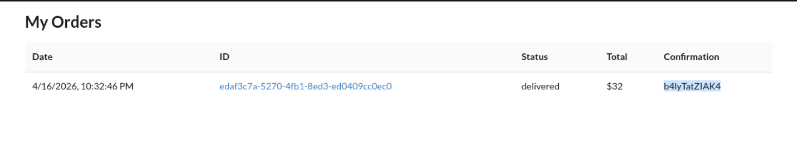
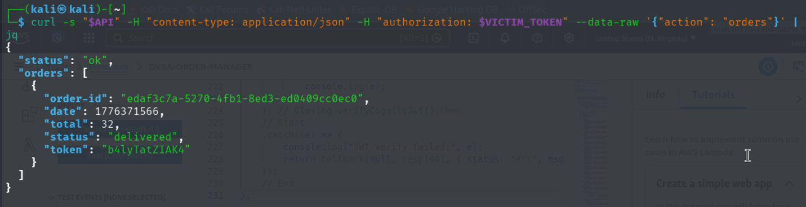
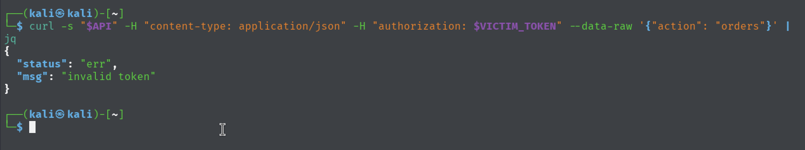

# Lesson #2: Broken Authentication

## Part 1) Goal and Vulnerability Summary

Broken authentication occurs when the backend trusts JWT payload claims without cryptographically verifying the token signature. The affected component is the order API authentication path in API Gateway and Lambda. The impact is user impersonation and unauthorized access to another user's order data.

Amazon Congnito should take care of user authentication. When the server doesn’t reach to it to verify the user and blindly trust user’s data, the attacker can exploit this and bypass the authentication step and get another user’s info.

## Part 2) Why This Works / Root Cause

It works because once the attacker has the victim’s username, the attacker can decode his own JWT and change the username in the payload of the JWT to the victim’s username and encode it again. Combining the obtained payload with the header and the signature (the remaining components of the JWT), the attacker gets new JWT. If this JWT (new one) sent to the server and the server doesn’t verify whether it is legitimate or no, the attacker can bass the authentication and get the victim’s data.

## Part 3) Environment and Setup

Two accounts, for attacker & victim

Burp Suit proxy for intercepting the traffic

JWT decoder/encoder tool (e.g. JWT.io website)

DVSA order API endpoint

Curl command line tool to send the http requests

## Part 4) Reproduction Steps

Create two accounts for attacker & victim

Place orders in both accounts

Turn Burp suit on & login to attacker’s account

Capture the access token from the post request of logging in

Store the access token in environment variable in the terminal

export attacker_token='eyJraWQiOi...'

Decode the captured token and keep it (you will get something like this

{

"sub": "attacker-uuid",

"username": "attacker@test.com",

"custom:is_admin": "false"

} )

Login to the victim’s account & Capture the access token from the post request of logging in

Decode the access token and get the victim’s username

In the attacker payload, change the username & sub of the attacker to the username & sub of the victim (Notice in this attack they are the same)

Encode the modified payload and add it to the remaining component of the JWT (the header and the signature)

Store the modified JWT in an environment variable

Send curl request with the modified JWT

curl -X POST "https://api-url/dvsa/order" \

-H "Content-Type: application/json" \

-H "authorization: $modified_token" \

-d '{"action":"orders"}'

## Part 5) Evidence and Proof

*Figure 3. Broken authentication exploit showing a modified JWT being accepted to access another user's order data.*

## Part 6) Fix Strategy / Probable Mitigation

The fix requires implementing JWT signature verification before trusting any claims from the token. There are two approaches:

Manual verification: using a JWT library to verify the signature with the Cognito’s public key

API Gateway authorizer: using Cognito Authorizer at the API GW to validate the tokens before reaching the Lambda function and execute.

## Part 7) Code / Config Changes

The fix is to verify the Cognito JWT signature and required claims before using username or sub for authorization. The backend should reject tampered tokens and only trust identities from verified tokens. This can be implemented inside the Lambda authentication helper or enforced with an API Gateway Cognito authorizer.

## Part 8) Verification After Fix

*Figure 4. Post-fix verification showing the forged JWT is rejected after token validation is enforced.*

## Part 9) Structured Operation and Security Analysis

Table A. Intended Logic and Exploit Behavior

| Vulnerability | Intended Rule(s) | Artifacts Used | Normal Behavior Evidence | Exploit Behavior Evidence |
| --- | --- | --- | --- | --- |
| Lesson #2: Broken Authentication | Only the authenticated user can access their own orders. JWT must be verified before trusted | JWT token, curl requests, Burp Suite, & JWT.io (or anything equivalent) | User A’s token only returns user A’s orders. User B’s token only returns user B’s orders. | Attacker can modify his own token and put the victim’s username instead of his username and generate the modified token and use it to get the victim’s orders. |

Table B. Deviation Analysis and Fix

| Vulnerability | Why This Is a Deviation | Deviation Class | Fix Applied (Where) | Post-Fix Verification |
| --- | --- | --- | --- | --- |
| Lesson #2: Broken Authentication | The server is trusting the JWT payload without any verification via the signature. The attacker can modify the token and claims he is the victim and the server will accept that. | Intentional misuse | The fix is applied in the order-manager.js function. Adding JWT signature verification. | Using modified JWT token returns Invalid token message. |

## Part 10) Takeaway / Lessons Learned

The main takeaway is never trusting user data input. That is because it can be modified by malicious users (e.g. attackers). Also, we should (as programmers) make use of the JWT signature and verify that the JWT hasn’t been tampered with.
