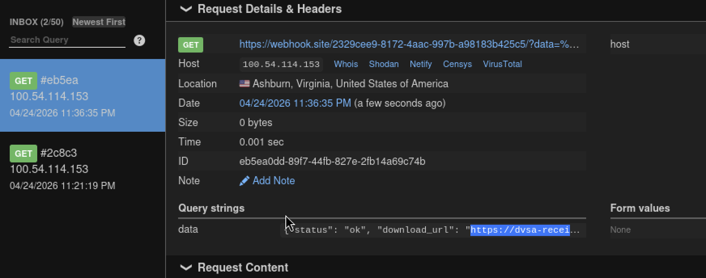
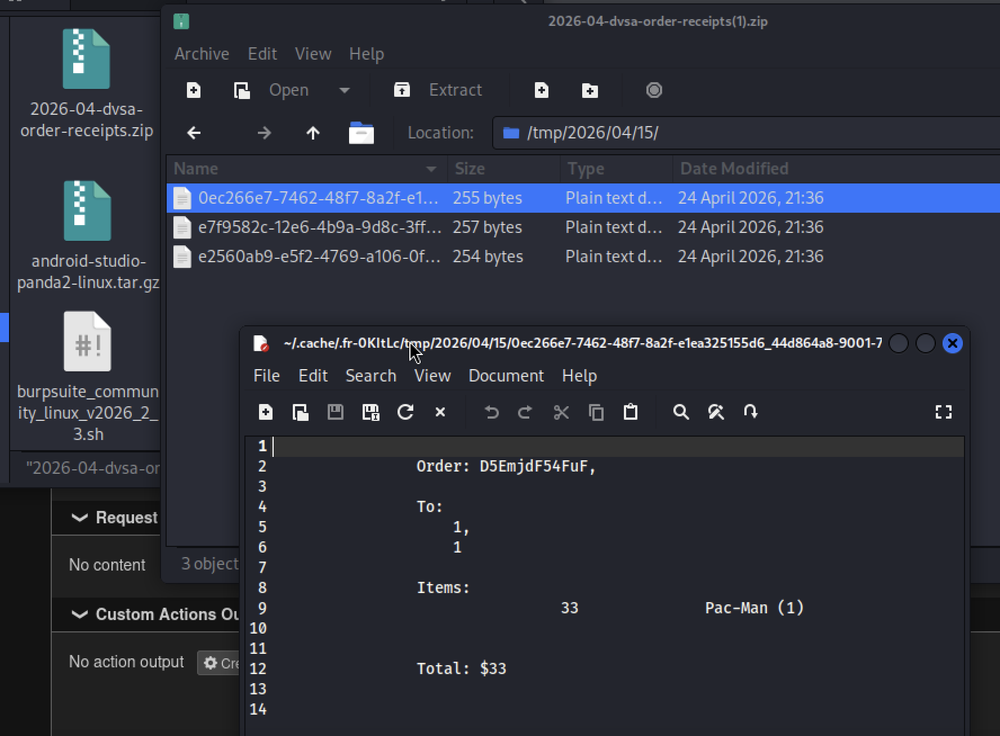
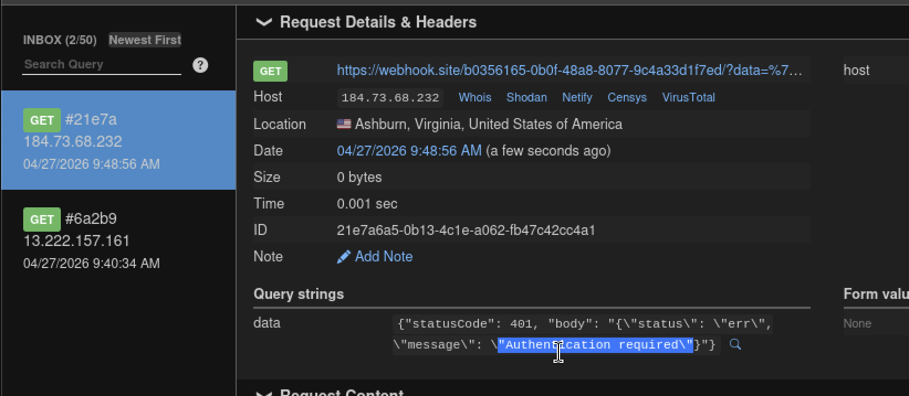

# Lesson #3: Sensitive Information Disclosure

## Part 1) Goal and Vulnerability Summary

Sensitive information disclosure occurs when receipt-generation functionality can be reached outside the intended admin boundary. By abusing the backend path, an attacker can trigger privileged receipt access and obtain links or files that should be restricted. The affected components are DVSA-ORDER-MANAGER, DVSA-ADMIN-GET-RECEIPT, Lambda authorization logic, and the S3 receipts bucket.

## Part 2) Why This Works / Root Cause

There are two types of users in this website. The first one is the normal user, this user can’t reach the admin function. The second type is the machine user, which has temporary identity that may enable it to access things it is not supposed to access. This is the case for type two, the DVSA-ORDER-MANAGE function is given IAM role which is higher than the actual need, which enable the attacker to look at admin functionalities.

## Part 3) Environment and Setup

Environment used: the DVSA order API endpoint, DVSA-ORDER-MANAGER, DVSA-ADMIN-GET-RECEIPT, S3 receipts bucket, CloudWatch Logs, curl, AWS Console, and a normal non-admin user token.

## Part 4) Reproduction Steps

1. Log in as a normal non-admin DVSA user. 2. Capture a valid authorization token and the order API endpoint. 3. Send a crafted request that reaches the receipt-generation workflow. 4. Observe that the backend produces or exposes receipt data that should require admin authorization. 5. Confirm the behavior in the API response and CloudWatch logs.

## Part 5) Evidence and Proof

The evidence shows the receipt workflow being reached and sensitive receipt output being exposed from a non-admin context.

*Figure 5. Sensitive information disclosure evidence showing receipt-related data exposed outside the intended admin boundary.*

*Figure 6. Additional sensitive information disclosure evidence showing receipt access through the vulnerable workflow.*

## Part 6) Fix Strategy / Probable Mitigation

As mentioned in the fix video, there are two layers of security

API GW, in this we should add admin privilege check before invoking the receipt function (DVSA-ADMIN-GET-RECEIPT)

Backend function (DVSA-ADMIN-GET-RECEIPT), for this we should add independent authorization & verification. Even if the caller bypass the first layer (the API GW) This function will verify the caller again.

## Part 7) Code / Config Changes

The two modified functions are:

DVSA-ORDER-MANAGER:

For this instead of this code instead

case "admin-orders":

if (isAdmin == "true") {

payload = { "user": user, "data": req["data"] };

functionName = "DVSA-ADMIN-GET-ORDERS";

break;

} else {

const response = {

statusCode: 403,

headers: {

"Access-Control-Allow-Origin" : "*"

},

body: JSON.stringify({"status": "err", "message": "Unauthorized"})

};

callback(null, response);

}

I added this

case "admin-receipt":

if (isAdmin == "true") {

payload = {

"user": user,

"isAdmin": String(isAdmin),

"year": req["year"],

"month": req["month"],

"day": req["day"]

};

functionName = "DVSA-ADMIN-GET-RECEIPT";

} else {

isOk = false;

const response = {

statusCode: 403,

headers: { "Access-Control-Allow-Origin": "*" },

body: JSON.stringify({"status": "err", "message": "Unauthorized"})

};

callback(null, response);

}

DVSA-ADMIN-GET-RECEIPT

Replacing the existing lambda_handler with this

def lambda_handler(event, context):

# ========== AUTHORIZATION CHECKS ==========

# Check if user is present

if "user" not in event:

return {

"statusCode": 401,

"body": json.dumps({"status": "err", "message": "Authentication required"})

}

# Check for admin privileges

is_admin = event.get("isAdmin", "false")

if str(is_admin).lower() != "true":

return {

"statusCode": 403,

"body": json.dumps({"status": "err", "message": "Unauthorized - Admin access required"})

}

# Input validation - prevent path traversal

year = event.get("year", "")

month = event.get("month", "")

day = event.get("day", "")

# Validate year format (YYYY)

if not re.match(r'^\d{4}$', str(year)):

return {

"statusCode": 400,

"body": json.dumps({"status": "err", "message": "Invalid year format"})

}

# Validate month if provided (01-12)

if month and not re.match(r'^(0[1-9]|1[0-2])$', str(month)):

return {

"statusCode": 400,

"body": json.dumps({"status": "err", "message": "Invalid month format"})

}

# Validate day if provided (01-31)

if day and not re.match(r'^(0[1-9]|[12][0-9]|3[01])$', str(day)):

return {

"statusCode": 400,

"body": json.dumps({"status": "err", "message": "Invalid day format"})

}

# original functionallity

try:

client = boto3.client('s3')

resource = boto3.resource('s3')

m = ""

d = ""

y = str(year)

if month:

m = str(month) + "/"

if day:

d = str(day) + "/"

prefix = f"{y}/{m}{d}"

bucket = os.environ.get("RECEIPTS_BUCKET")

if not bucket:

return {

"statusCode": 500,

"body": json.dumps({"status": "err", "message": "Configuration error"})

}

# Create unique filename to prevent collisions

import time

timestamp = int(time.time())

zip_file = f"receipts_{y}_{month}_{day}_{timestamp}.zip"

download_dir(client, resource, prefix, '/tmp', bucket)

zf = zipfile.ZipFile(f"/tmp/{zip_file}", "w")

for dirname, subdirs, files in os.walk("/tmp"):

for filename in files:

if filename.endswith(".txt"):

filepath = os.path.join(dirname, filename)

# Store with relative path to avoid exposing filesystem structure

arcname = os.path.basename(filepath)

zf.write(filepath, arcname)

zf.close()

# Generate signed URL with shorter expiry (15 min instead of 1 hour)

signed_link = client.generate_presigned_url(

'get_object',

Params={'Bucket': bucket, 'Key': f"zip/{zip_file}"},

ExpiresIn=900  # 15 minutes

)

res = {"status": "ok", "download_url": signed_link}

return res

except Exception as e:

print(f"Error in admin get receipt: {str(e)}")

return {

"statusCode": 500,

"body": json.dumps({"status": "err", "message": "Internal server error"})

}

## Part 8) Verification After Fix

*Figure 7. Post-fix verification showing unauthorized receipt access is blocked after admin authorization checks are added.*

## Part 9) Structured Operation and Security Analysis

Table A. Intended Logic and Exploit Behavior

| Vulnerability | Intended Rule(s) | Artifacts Used | Normal Behavior Evidence | Exploit Behavior Evidence |
| --- | --- | --- | --- | --- |
| Lesson #3: Sensitive Information Disclosure | Only authenticated admin users may retreve receipt data. The backend must verify both authentication (user filed exist) and (isAdmin == true) for every request | Order-manager.js source code, DVSA-ADMIN-GET-RECEIPT function, curl command line tool. | Admin user with valid token and isAdmin == true receives download URL for the requested receipts. | Non-admin user or any request without authentication can use IAM and direct the request to the DVSA-ADMIN-GET-RECEIPTS and get the download link. |

Table B. Deviation Analysis and Fix

| Vulnerability | Why This Is a Deviation | Deviation Class | Fix Applied (Where) | Post-Fix Verification |
| --- | --- | --- | --- | --- |
| Lesson #3: Sensitive Information Disclosure | The original DVSA-ADMIN-GET-RECEIPTS function has no authorization checks. Any user who could just invoke the lambda could retrieve all recipts data for any date range. This violates the intended rule that this is an admin privilege function. | Missing authorization in the process | As mentioned previously, the added code in order-manager.js and alos the replaced lambda-handeler function in dvsa-admin-get-receipts. | As shown in the fix proof, regular users receive 403 Unauthorized when attempting to invoke dvsa-admin-get-receipts. |

## Part 10) Takeaway / Lessons Learned

Never trust the implicit authorization in serverless architectures. Lambda functions can be invoked from multiple sources. As a result, every function must independently verify authentication & authorization.
