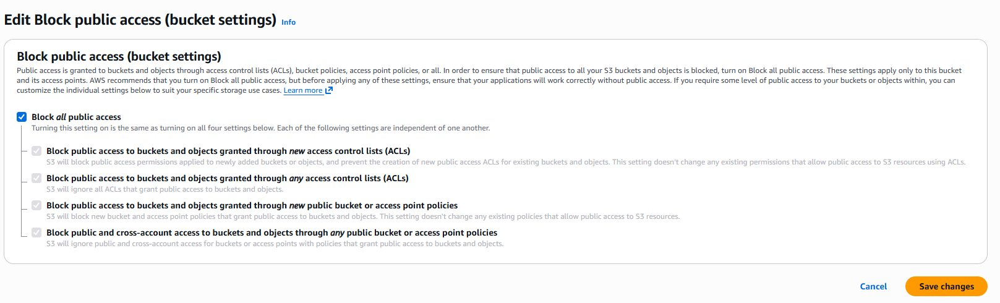
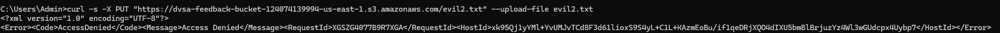

# Lesson #4: Insecure Cloud Configuration

## Part 1) Goal and Vulnerability Summary

The dvsa-feedback-bucket S3 bucket is publicly accessible with no authentication required. Any attacker on the internet can upload files directly to the bucket and read them back. This also triggers the DVSA-FEEDBACK-UPLOADS Lambda function, creating a path for backend influence. The root weakness is a missing access control policy on the storage layer.

## Part 2) Why This Works / Root Cause

The S3 bucket has a policy that allows anyone to put and get objects enabled. No file type or content validation exists either at the bucket or in the code.

## Part 3) Environment and Setup

Target S3 Bucket: dvsa-feedback-bucket-124074139994-us-east-1

Triggered Lambda: DVSA-FEEDBACK-UPLOADS

Tools: curl and AWS S3 Console

The exploit requests were unauthenticated.

## Part 4) Reproduction Steps

Create a malicious file locally:

echo This is a malicious file > evil.txt

Upload it directly to the S3 bucket with no credentials:

curl -s -X PUT "https://dvsa-feedback-bucket-124074139994-us-east-1.s3.amazonaws.com/evil2.txt" --upload-file evil.txt

Verify it is publicly readable:

curl -s "https://dvsa-feedback-bucket-124074139994-us-east-1.s3.amazonaws.com/evil2.txt"

Observe the file contents returned confirming both unauthenticated write and public read.

## Part 5) Evidence and Proof

Figure 8 shows the exploit. The PUT returned an empty response and the GET returned the file contents publicly with no credentials used at any point, bypassing authentication.

*Figure 8. Unauthenticated file upload and public read confirmed.*

## Part 6) Fix Strategy / Probable Mitigation

Enable Block Public Access on the feedback bucket. This stops the current bucket policy which permits Block public access and prevents all unauthenticated access, and the bucket policy should allow only the DVSA Lambda execution role to write files.

## Part 7) Code / Config Changes

Block Public Access was enabled on the bucket via the AWS S3 Console. Figure 9 shows the configuration with all four options enabled.

*Figure 9. Block all public access enabled on dvsa-feedback-bucket.*

## Part 8) Verification After Fix

The same upload command now returns AccessDenied as shown in Figure 10, showing that unauthenticated uploads are no longer possible.

*Figure 10. AccessDenied returned after fix.*

## Part 9) Structured Operation and Security Analysis

Table A. Intended Logic and Exploit Behavior

| Vulnerability | Intended Rule(s) | Artifacts Used | Normal Behavior Evidence | Exploit Behavior Evidence |
| --- | --- | --- | --- | --- |
| Lesson #4: Insecure Cloud Configuration | Only authenticated Lambda execution roles may write to the feedback bucket. No public read or write access is permitted. | S3 bucket policy, Block Public Access settings, curl commands, AWS Console S3 Permissions tab | Unauthenticated PUT requests should return AccessDenied. | curl PUT with no credentials returned empty (success). curl GET returned file contents publicly. |

Table B. Deviation Analysis and Fix

| Vulnerability | Why This Is a Deviation | Deviation Class | Fix Applied (Where) | Post-Fix Verification |
| --- | --- | --- | --- | --- |
| Lesson #4: Insecure Cloud Configuration | Any internet user could upload and read files with no credentials. This violates the intended rule that only authorized Lambda functions should access the bucket. | Accidental misconfiguration | S3 bucket: dvsa-feedback-bucket. Enabled all four Block Public Access settings via AWS S3 Console. | Same curl PUT command returned AccessDenied. File upload no longer possible without credentials. |

## Part 10) Takeaway / Lessons Learned

S3 buckets holding user content should never be publicly writable. Block Public Access should be enabled at the account level by default. The general principle is least privilege. No resource should be publicly accessible unless it explicitly needs to be.
