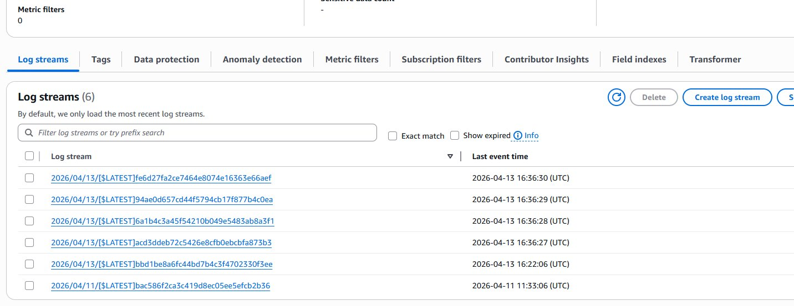
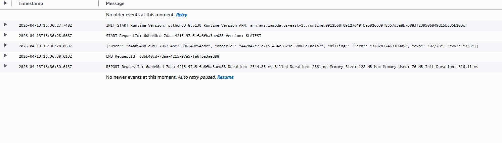
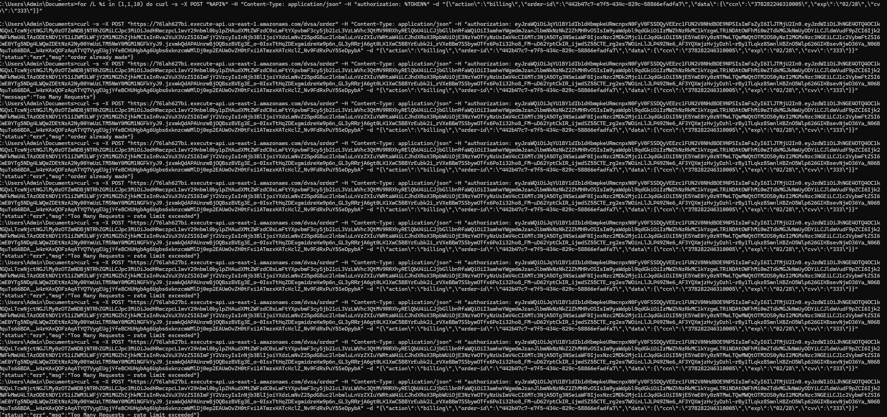
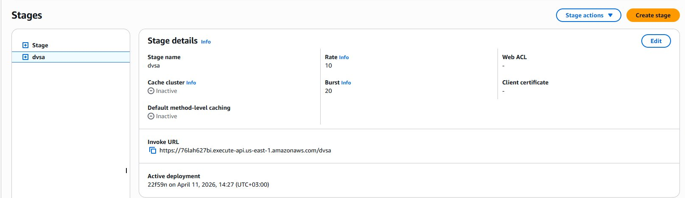

# Lesson #6: Denial of Service (DoS)

## Part 1) Goal and Vulnerability Summary

The DVSA-ORDER-BILLING Lambda has no rate limiting or concurrency protection. An attacker can send many concurrent billing requests to exhaust the available Lambda concurrency and make the billing service unavailable to legitimate users.

## Part 2) Why This Works / Root Cause

The API Gateway stage was configured with Rate 10000 and Burst 5000 and the Lambda code had no rate limiting as well, and the server had an account concurrency limit of 10, so a flood of concurrent requests quickly exhausts all available slots and causes Internal Server Errors for everyone.

## Part 3) Environment and Setup

API Endpoint: https://76lah627bi.execute-api.us-east-1.amazonaws.com/dvsa/order

Target Lambda: DVSA-ORDER-BILLING in order_billing.py

API Gateway Stage: dvsa

Tools: curl and AWS Console

## Part 4) Reproduction Steps

Send 50 concurrent billing requests to flood the service:

for /L %i in (1,1,50) do start /B curl -s -X POST "%API%" -H "Content-Type: application/json" -H "authorization: %TOKEN%" -d "{\"action\":\"billing\",\"order-id\":\"<order-id>\",\"data\":{\"ccn\":\"378282246310005\",\"exp\":\"02/28\",\"cvv\":\"333\"}}"

Observe the flood of Internal Server Error responses as Lambda concurrency is exhausted.

Check CloudWatch Logs for DVSA-ORDER-BILLING to see multiple simultaneous log streams.

## Part 5) Evidence and Proof

Figure 13 shows six simultaneous CloudWatch log streams created within the same second during the flood, confirming concurrent Lambda exhaustion.

*Figure 13. Six simultaneous Lambda invocations all created within the same second.*

Figure 14 shows the billing Lambda taking 2544ms under load. Normal billing requests complete much faster.

*Figure 14. Billing Lambda log showing 2544ms execution time under concurrent load.*

Figure 15 shows the terminal output from the flood. The vast majority of responses are Internal Server Errors.

*Figure 15. Terminal flood output showing mostly Internal Server Errors.*

## Part 6) Fix Strategy / Probable Mitigation

Two fixes were applied. First the API Gateway stage throttling was reduced from Rate 10000 to Rate 1 with Burst 2. Second a per-user rate limiter was added directly to the billing Lambda code using DynamoDB to track requests per user per minute window.

## Part 7) Code / Config Changes

Figure 16 shows the API Gateway stage before the fix with Rate 10000 and Burst 5000:

*Figure 16. API Gateway stage before fix. Rate 10000 and Burst 5000.*

Figure 17 shows the stage after the fix with Rate 1 and Burst 2:

*Figure 17. API Gateway stage after fix. Rate 1 and Burst 2.*

The following rate limiter was added to order_billing.py:

def check_rate_limit(user_id, table):

current_window = int(time.time())

rate_key = f'ratelimit_{user_id}_{current_window}'

try:

table.update_item(

Key={'orderId': rate_key, 'userId': user_id},

UpdateExpression='ADD requestCount :inc SET expiryTime = :exp',

ExpressionAttributeValues={':inc': Decimal(1), ':exp': Decimal(int(time.time()) + 120), ':limit': Decimal(3)},

ConditionExpression='attribute_not_exists(requestCount) OR requestCount < :limit'

)

return True

except Exception:

return False

## Part 8) Verification After Fix

After the fix the flood returns Too Many Requests rate limit exceeded after 3 attempts per user per minute as shown in Figure 18.

*Figure 18. Rate limit exceeded message blocking flood requests after fix.*

## Part 9) Structured Operation and Security Analysis

Table A. Intended Logic and Exploit Behavior

| Vulnerability | Intended Rule(s) | Artifacts Used | Normal Behavior Evidence | Exploit Behavior Evidence |
| --- | --- | --- | --- | --- |
| Lesson #6: Denial of Service | The billing service must remain available to all users. No single user should exhaust Lambda concurrency through concurrent requests. | curl flood commands, CloudWatch log streams, Lambda concurrency metrics, API Gateway stage settings | A single billing request completes successfully in normal conditions. | 50 concurrent requests caused over 40 Internal Server Errors. Six simultaneous Lambda invocations visible in CloudWatch within one second. |

Table B. Deviation Analysis and Fix

| Vulnerability | Why This Is a Deviation | Deviation Class | Fix Applied (Where) | Post-Fix Verification |
| --- | --- | --- | --- | --- |
| Lesson #6: Denial of Service | A single user exhausted Lambda concurrency making the service unavailable. No rate limiting existed at API or Lambda level. | Intentional misuse / security-relevant abuse | API Gateway stage throttling reduced to Rate 1 and Burst 2. Lambda code rate limiter added to order_billing.py limiting each user to 3 requests per minute. | Flood now returns Too Many Requests rate limit exceeded after 3 attempts. Service protected from per-user flooding. |

## Part 10) Takeaway / Lessons Learned

Serverless billing endpoints need multiple layers of protection. Lambda concurrency limits are shared across all functions so exhausting them affects the whole application. Rate limiting should be applied at both the API Gateway and code level to catch floods before they reach the backend.
