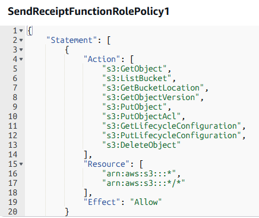
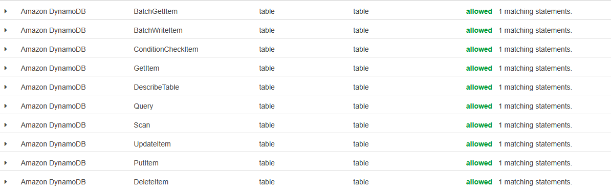
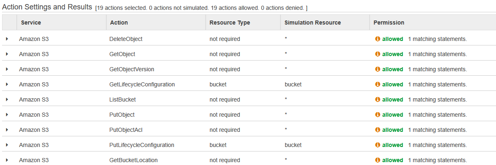
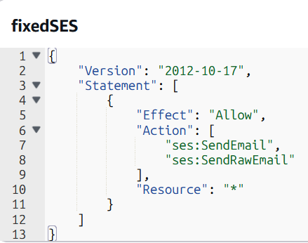
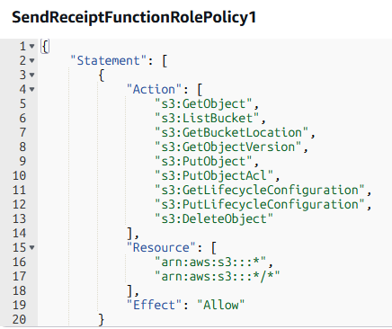
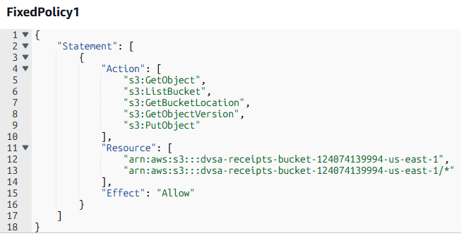
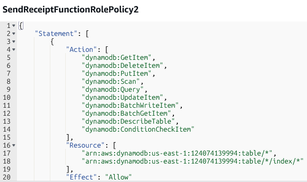
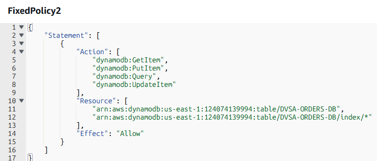
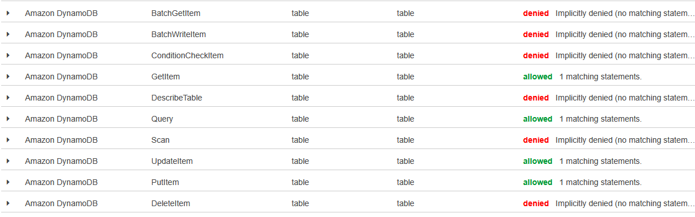

# Lesson #7: Over-Privileged Functions

## Part 1) Goal and Vulnerability Summary

The DVSA-SEND-RECEIPT-EMAIL Lambda function is assigned an execution role with overly broad IAM permissions. The role allows access to all S3 buckets and all DynamoDB tables using wildcard (*) resources. This significantly increases the blast radius if the function is abused or compromised. The main weakness is excessive permissions granted to the Lambda execution role, violating the principle of least privilege.

## Part 2) Why This Works / Root Cause

The weakness in this lesson is not the business logic of the function itself, but the excessive IAM permissions attached to its execution role. In AWS serverless systems, any code running inside a Lambda function automatically inherits the role’s temporary credentials. As a result, if the function is abused or compromised, the attacker can perform any AWS action allowed by that role, even if those actions are unrelated to the function’s intended purpose. The root cause is therefore over-privileged role design and failure to enforce the principle of least privilege.

## Part 3) Environment and Setup

Target Lambda: DVSA-SEND-RECEIPT-EMAIL

Execution Role: serverlessrepo-OWASP-DVSA-SendReceiptFunctionRole

Tools: AWS Console, IAM Policy Simulator

## Part 4) Reproduction Steps

Open the AWS Management Console.

Navigate to Lambda → Functions.

Search for and open:

DVSA-SEND-RECEIPT-EMAIL

Go to:

Configuration → Permissions

Under Execution Role, click the role name to open it in IAM.

On the Permissions tab, review the attached policies and identify:

S3 wildcard access (arn:aws:s3:::*, arn:aws:s3:::*/*)

DynamoDB wildcard access (table/*)

Full SES access (ses:*)

Navigate to the “Simulate” option on the Permissions page.

In the Policy Simulator:

Select service: S3 (Amazon S3)

Add actions: GetObject, PutObject

Run simulation and observe that access is Allowed.

Test DynamoDB permissions:

Select service: Amazon DynamoDB

Add actions: Scan, GetItem, PutItem, DeleteItem

Run simulation and observe all actions are Allowed.

Confirm that the Lambda execution role allows access to resources beyond its intended purpose, demonstrating over-privileged permissions.

## Part 5) Evidence and Proof

The IAM role attached to the DVSA-SEND-RECEIPT-EMAIL Lambda function contains multiple policies with overly broad permissions. These include full SES access, wildcard S3 access, wildcard DynamoDB access, and Policy Simulator results confirming that all tested actions are allowed for arbitrary resources.

*Figure 19. AmazonSESFullAccess policy showing full SES permissions (ses:*) on all resources.*

*Figure 20. S3 policy showing wildcard access (arn:aws:s3:::* and arn:aws:s3:::*/*) allowing full access to all buckets and objects.*

*Figure 21. DynamoDB policy showing wildcard access (table/*) allowing operations on all tables and indexes.*

*Figure 22. IAM Policy Simulator showing multiple S3 and DynamoDB actions allowed for arbitrary resources, confirming over-privileged access.*

## Part 6) Fix Strategy / Probable Mitigation

The Lambda execution role must be reduced to only the permissions required for the receipt workflow. The current wildcard access to S3 buckets, DynamoDB tables, and full SES permission must be removed. Instead, access must be restricted to specific resources and only the required actions. This ensures that the function cannot access or modify unrelated AWS resources.

## Part 7) Code / Config Changes

SES policy before fix:

*Figure 23. SES policy before fix showing broad SES permissions before remediation.*

SES after fix:

*Figure 24. SES policy after fix showing reduced SES permissions.*

policy 1 before fix:

*Figure 25. S3 policy before fix showing wildcard bucket and object access.*

policy 1 after fix:

*Figure 26. S3 policy after fix showing restricted bucket and object access.*

policy 2 before fix:

*Figure 27. DynamoDB policy before fix showing wildcard table access.*

policy 2 after fix:

*Figure 28. DynamoDB policy after fix showing least-privilege table access.*

## Part 8) Verification After Fix

The IAM Policy Simulator confirms that S3 access is restricted to only the necessary actions, and all unnecessary or dangerous actions such as DeleteObject are denied.

*Figure 29. IAM Policy Simulator showing restricted S3 permissions with only necessary actions allowed and unauthorized actions denied.*

The IAM Policy Simulator shows that only required DynamoDB actions are allowed, while all unrelated and dangerous actions are denied after applying least-privilege policies.

*Figure 30. IAM Policy Simulator showing restricted DynamoDB access where only required actions are allowed and all other actions are denied.*

## Part 9) Structured Operation and Security Analysis

Table A. Intended Logic and Exploit Behavior

| Vulnerability | Intended Rule(s) | Artifacts Used | Normal Behavior Evidence | Exploit Behavior Evidence |
| --- | --- | --- | --- | --- |
| Lesson #7: Over-Privileged Functions | The Lambda function should only access required resources such as the receipts S3 bucket and the DVSA-ORDERS-DB table, and only perform minimal actions necessary for sending receipts. | IAM role policies, AWS Console, IAM Policy Simulator results | Access to unrelated S3 buckets and DynamoDB tables should be denied. Only required actions should be allowed. | Policy Simulator shows that actions such as GetObject, PutObject, Scan, and DeleteTable are allowed for arbitrary resources, indicating excessive permissions. |

Table B. Deviation Analysis and Fix

| Vulnerability | Why This Is a Deviation | Deviation Class | Fix Applied (Where) | Post-Fix Verification |
| --- | --- | --- | --- | --- |
| Lesson #7: Over-Privileged Functions | The Lambda execution role allows access to all S3 buckets, all DynamoDB tables, and full SES actions. This violates the intended rule that the function should only access specific resources required for its operation. | Accidental misconfiguration | IAM role policies updated by removing wildcard access and restricting permissions to the receipts bucket, DVSA-ORDERS-DB table, and minimal SES actions. | Policy Simulator shows that unrelated S3 and DynamoDB actions are denied, while only required actions remain allowed. |

## Part 10) Takeaway / Lessons Learned

This vulnerability highlights the importance of applying the principle of least privilege in cloud environments. The Lambda execution role was over-privileged, allowing access to all S3 buckets, DynamoDB tables, and SES actions, which increased the potential impact of an attack. By restricting permissions to only the required resources and actions, the risk was significantly reduced. This demonstrates that proper IAM configuration is essential for securing serverless applications.
