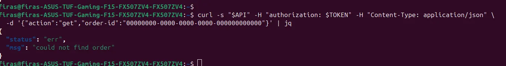
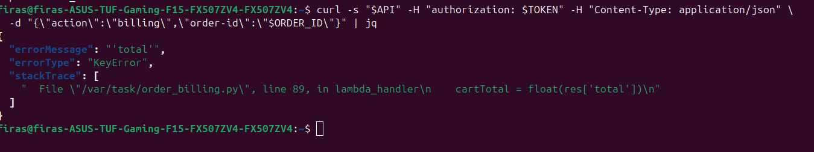
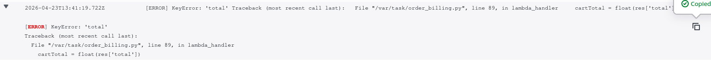
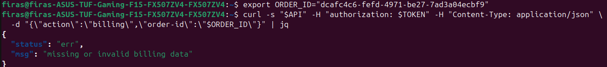
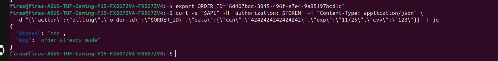

# Lesson #10: Unhandled Exceptions

## Part 1) Goal and Vulnerability Summary

DVSA's backend Lambda functions return raw Python and Node.js stack traces, internal file paths, and code fragments to clients whenever a request causes an unhandled exception. The primary affected components are DVSA-ORDER-MANAGER (the API entry point), DVSA-ORDER-GET, DVSA-ORDER-BILLING, and DVSA-GET-CART-TOTAL. The impact is information disclosure: an attacker learns internal file layout (/var/task/...), exact line numbers, variable names, handler flow, and sometimes environment hints, which together accelerate follow-on attacks such as SQL injection, path manipulation, and IAM abuse. The main weakness is that none of the Lambda handlers wrap their main logic in a centralized try/except that maps exceptions to a generic client-safe response.

## Part 2) Why This Works / Root Cause

AWS Lambda's default behavior, when a Python handler raises an uncaught exception, is to return a JSON body containing errorMessage, errorType, and a full stackTrace. When API Gateway proxies that Invoke response back to the client, those diagnostic fields are visible in the HTTP response. In DVSA, the handlers assume the payload shape is always well-formed (for example event["orderId"], event["user"], event["billing"]) and perform no input validation. Any missing or wrongly-typed field (KeyError, AttributeError, TypeError) bubbles up as a 500 with full diagnostics. In the Node.js order-manager.js the root-level catch at line 183 only calls console.log(e) and never returns a normalized error response, so clients can see whatever the downstream Invoke response happened to contain.

## Part 3) Environment and Setup

API Endpoint: https://76lah627bi.execute-api.us-east-1.amazonaws.com/dvsa/order

Vulnerable Lambdas: DVSA-ORDER-GET (backend/functions/order/get_order.py), DVSA-ORDER-BILLING (backend/functions/order/order_billing.py), DVSA-GET-CART-TOTAL (backend/functions/processing/get_cart_total.py), DVSA-ORDER-MANAGER (backend/functions/order-manager/order-manager.js)

Tools: curl, a valid Cognito access token captured via browser DevTools (same technique as Lesson #2)

AWS region: us-east-1

CloudWatch log groups: /aws/lambda/DVSA-ORDER-GET, /aws/lambda/DVSA-ORDER-BILLING, /aws/lambda/DVSA-GET-CART-TOTAL

## Part 4) Reproduction Steps

Three independent triggers were tested. Triggers 1 and 3 were found to be remediated in the deployed SAR version; Trigger 2 still leaks internal diagnostics, which is sufficient proof of the lesson. All three are documented here for completeness as required by the Project Description's "Important Update Note."

Trigger 1: Non-existent order ID (no longer vulnerable):

curl -s "$API" -H "authorization: $TOKEN" -H "Content-Type: application/json" \ -d '{"action":"get","order-id":"00000000-0000-0000-0000-000000000000"}' | jq

Observed response: {"status":"err","msg":"could not find order"}. The handler now short-circuits on missing records before any type-sensitive operation. No stack trace is returned.

Trigger 2: Missing data field on billing (VULNERABLE):

# Step 1: create a real order and capture its id

curl -s "$API" -H "authorization: $TOKEN" -H "Content-Type: application/json" \

-d '{"action":"new","cart-id":"test10","items":{"1":1}}' | jq

export ORDER_ID="<order-id from response>"

# Step 2: send a billing request with no billing data

curl -s "$API" -H "authorization: $TOKEN" -H "Content-Type: application/json" \

-d "{\"action\":\"billing\",\"order-id\":\"$ORDER_ID\"}" | jq

Observed response: full Python stack trace (see Figure 33 in Part 5). The handler's attempt to read res['total'] from the cart-total subcall raises a KeyError that is not caught, so the Lambda runtime serializes it into the HTTP body.

Trigger 3: Non-numeric item ID (no longer vulnerable as a distinct trigger):

Tested with items:{"abc":1} followed by shipping and billing. The SQL error is caught internally by get_cart_total, which returns a response without a total field, so billing crashes at the same line 89 as Trigger 2 with the same KeyError: 'total'. This does not provide new evidence beyond Trigger 2.

## Part 5) Evidence and Proof

*Figure 32. Trigger 1 observed behavior — no longer vulnerable.*

*Figure 33. Trigger 2 — missing data field on billing causes unhandled KeyError: 'total'. Response leaks internal file path /var/task/order_billing.py line 89 and the exact dereferencing code cartTotal = float(res['total'])."*

*Figure 34. CloudWatch log group /aws/lambda/DVSA-ORDER-BILLING showing the same [ERROR] KeyError: 'total' traceback on the server side, confirming the exception is uncaught by the handler and the same internal file path and line number are recorded in AWS logs.*

## Part 6) Fix Strategy / Probable Mitigation

Apply a two-layer defense.

Layer 1: schema validation at the API entry point: DVSA-ORDER-MANAGER must validate req.action against an allowlist and confirm that the fields required by that action are present and well-typed before invoking any downstream Lambda.

Layer 2: central exception handling in each Lambda: wrap the body of every lambda_handler in try/except Exception that logs the full trace to CloudWatch (via print) but returns only a generic {"status":"err","msg":"internal error"} to the client. Additionally, defensive checks on inter-service responses (for example verifying that the cart-total subcall returned a total key before dereferencing it) prevent cascading failures. This combination keeps rich diagnostics for operators in CloudWatch while guaranteeing clients see no internal details.

## Part 7) Code / Config Changes

*Figure 35. Lambda code editor showing successful deployment of the patched DVSA-ORDER-BILLING function. The try: wrapper is visible at line 42 directly following def lambda_handler at line 41, and the green "Successfully updated the function DVSA-ORDER-BILLING" banner confirms the new code is live.*

Before:

def lambda_handler(event, context):

print(json.dumps(event))

...

orderId = event["orderId"]

userId = event["user"]

...

req = http.request("POST", url, body=data, headers={...})

res = json.loads(req.data)

cartTotal = float(res['total'])   # <-- line 89: KeyError leaks stack trace

...

After:

def lambda_handler(event, context):

try:

print(json.dumps(event))

...

orderId = event["orderId"]

userId = event["user"]

...

# INPUT VALIDATION

if "billing" not in event or not isinstance(event.get("billing"), dict):

return {"status": "err", "msg": "missing or invalid billing data"}

req = http.request("POST", url, body=data, headers={...})

res = json.loads(req.data)

# DEFENSIVE CHECK

if "total" not in res:

return {"status": "err", "msg": "could not calculate order total"}

cartTotal = float(res['total'])

...

return res

except Exception:

import traceback

print("ERROR:", traceback.format_exc())

return {"status": "err", "msg": "internal error"}

## Part 8) Verification After Fix

After redeployment, the same Trigger 2 curl command — sending a billing request with no data field

*Figure 36. After redeployment, the same Trigger 2 curl command — sending a billing request with no data field.*

*Figure 37. Proves the vulnerability is fixed (broken request no longer leaks a stack trace)*

*Figure 38. Proves legitimate flow still works (fix didn't break anything)*

## Part 9) Structured Operation and Security Analysis

Table A. Intended Logic and Exploit Behavior

| Vulnerability | Intended Rule(s) | Artifacts Used | Normal Behavior Evidence | Exploit Behavior Evidence |
| --- | --- | --- | --- | --- |
| Lesson #10: Unhandled Exceptions | Lambda handlers must never return internal diagnostics (file paths, line numbers, stack traces, exception types) to clients. All exceptions must be caught centrally and mapped to a generic client-safe message. Detailed diagnostics belong only in CloudWatch. | curl API responses (Figures 33, 36, 38); CloudWatch log group /aws/lambda/DVSA-ORDER-BILLING (Figure 34); Lambda source file order_billing.py; Lambda code editor (Figure 35). | A real order placed through the DVSA UI completes payment successfully; a repeat billing attempt returns order already made. No stackTrace field is ever present. | [A billing request with the data field omitted returns a body containing errorMessage: 'total', errorType: KeyError, and a stackTrace array listing /var/task/order_billing.py line 89 with the exact expression cartTotal = float(res['total']). |

Table B. Deviation Analysis and Fix

| Vulnerability | Why This Is a Deviation | Deviation Class | Fix Applied (Where) | Post-Fix Verification |
| --- | --- | --- | --- | --- |
| Lesson #10: Unhandled Exceptions | The DVSA-ORDER-BILLING Lambda returned raw Python traceback data to the client, disclosing the internal file path, line number, variable names, and exception class. This violates the boundary between operator diagnostics (CloudWatch only) and client-facing errors (generic only). | Accidental misconfiguration | order_billing.py: wrapped lambda_handler body in try/except Exception; added input validation on the billing field; added a defensive check on the cart-total response's total key. | The previously-leaking trigger now returns only missing or invalid billing data (Figure 36). Legitimate billing flow through the UI still succeeds and returns order already made on repeat (Figure 38). |

## Part 10) Takeaway / Lessons Learned

In serverless systems the client and the operator should see different views of failure. The operator needs full diagnostics in CloudWatch to debug; the client must only ever see a generic message. DVSA's default Lambda behavior inverts this: every unhandled exception is serialized and returned to whoever triggered it. The general design principle is defense in depth around errors. Validate input at the boundary, wrap every handler in a catch-all, log richly on the server, and return a small fixed set of client-safe messages. This pattern defeats a broad class of reconnaissance attacks (path discovery, code version fingerprinting, dependency enumeration) at negligible implementation cost.
