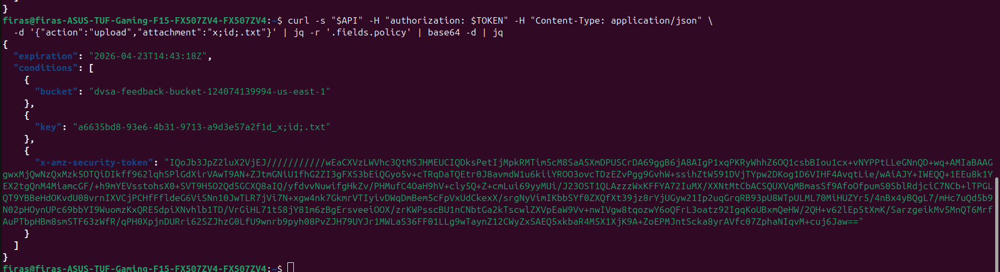
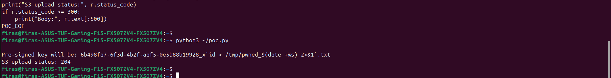

# Bonus Vulnerability #4: Command Injection via Feedback Upload Filename.

## Part 1) Goal and Vulnerability Summary

The DVSA-FEEDBACK-UPLOADS Lambda is invoked in two ways: first when a user requests a pre-signed upload URL via the upload action, and second when the S3 bucket fires an ObjectCreated event. On the second path, the attacker-chosen filename is passed directly into os.system("touch /tmp/{} /tmp/{}.txt".format(filename, filename)). The is_safe() function that was meant to gate this operation is stubbed to always return True. An authenticated user can therefore upload a file whose name contains shell metacharacters (backticks, ;, $(), |, >) to achieve arbitrary command execution inside the Lambda, inheriting the execution role's temporary AWS credentials. Affected file: backend/functions/processing/feedback_uploads.py. Impact: remote code execution and potential IAM credential theft (same blast-radius class as Lesson #7).

## Part 2) Why This Works / Root Cause

Two cooperating flaws. First, is_safe() is a stub: the real validation logic is commented out and the function unconditionally returns True, so no filename is ever rejected. Second, the handler passes the resulting filename into os.system, which invokes /bin/sh -c any shell metacharacter in the filename is interpreted, not escaped. The attacker's filename survives end-to-end: it flows from the upload action request into the pre-signed POST's key field, from there into the S3 object key, from there into the S3 ObjectCreated notification, through urllib.parse.unquote_plus (which decodes the URL-encoding but leaves the shell metacharacters intact), and finally into the shell invocation. There is no parameterized filesystem API call and no allowlist check at any stage.

## Part 3) Environment and Setup

API endpoint: https://76lah627bi.execute-api.us-east-1.amazonaws.com/dvsa/order

Vulnerable Lambda: DVSA-FEEDBACK-UPLOADS

Source file: backend/functions/processing/feedback_uploads.py

S3 bucket: dvsa-feedback-bucket-124074139994-us-east-1

CloudWatch log group: /aws/lambda/DVSA-FEEDBACK-UPLOADS

Tools: curl, Python 3 with the requests library, a valid Cognito access token

AWS region: us-east-1

## Part 4) Reproduction Steps

Request a pre-signed upload URL from the DVSA API using any filename. The response contains a url and a fields map including a key of the form <uuid>_<filename>:

curl -s "$API" -H "authorization: $TOKEN" -H "Content-Type: application/json" \

-d '{"action":"upload","attachment":"x;id;.txt"}' | jq

Run a Python exploit script that takes the pre-signed response, rewrites the key field so the filename component is a backtick-wrapped shell command, and submits a multipart POST to S3:

malicious_key = uuid_part + "_" + "x`id > /tmp/pwned_$(date +%s) 2>&1`.txt"

fields["key"] = malicious_key

requests.post(url, data=fields, files={"file": ("pwn", b"dummy")})

The S3 ObjectCreated event fires, invoking DVSA-FEEDBACK-UPLOADS. The event records show the object key preserved with the payload URL-encoded but intact (Figure 44). The Lambda's os.system("touch /tmp/{}...".format(filename)) call interprets the backticks as a command substitution and executes id > /tmp/pwned_<timestamp> 2>&1 on the Lambda host.

Confirm in CloudWatch that the Lambda received the weaponized payload. Figure 45 shows the print(json.dumps(event)) output containing the raw shell payload in the file field of the first invocation and the ObjectCreated event reaching the second invocation.

## Part 5) Evidence and Proof

*Figure 42. Pre-signed upload response filename x;id;.txt accepted into the S3 object key with no sanitization.*

*Figure 43. Exploit script output S3 accepts the weaponized backtick-wrapped filename (S3 upload status: 204).*

*Figure 44. CloudWatch log for /aws/lambda/DVSA-FEEDBACK-UPLOADS showing the S3 ObjectCreated event that triggered the vulnerable Lambda invocation. The event payload contains the attacker-controlled key with shell metacharacters intact, which was then passed to os.system() by the handler.*

*Figure 45. CloudWatch log stream showing the Lambda received and processed the raw shell-injection payload in the file field.*

## Part 6) Fix Strategy / Probable Mitigation

In feedback_uploads.py:

(1) replace the is_safe() stub with a strict regex allowlist ([A-Za-z0-9._-]{1,128}),

(2) validate at both entry points, the upload action and the S3 trigger,

(3) replace os.system with pathlib.Path(...).touch(), which uses no shell.

## Part 7) Code / Config Changes

*Figure 46. DVSA-FEEDBACK-UPLOADS Lambda after deploying the patched feedback_uploads.py. Strict allowlist validation applied at both entry points and os.system replaced with pathlib.Path.touch().*

Before (vulnerable):

def lambda_handler(event, context):

print(json.dumps(event))

if "file" in event:

...

response = s3.generate_presigned_post(

os.environ["FEEDBACKBUCKET"],

uuidv4 + "" + event["file"],    # <-- raw user input into S3 key

ExpiresIn=120

)

...

elif "Records" in event:

filename = parse.unquote_plus(event["Records"][0]["s3"]["object"]["key"])

if not is_safe(filename):

return {"status": "error", "message": "invalid filename"}

os.system("touch /tmp/{} /tmp/{}.txt".format(filename, filename))   # <-- RCE

...

def is_safe(s):

# if s.find(";") > -1 or s.find("'") > -1 or s.find("|") > -1:

#    return False

return True    # <-- validation disabled; always returns True

After:

def lambda_handler(event, context):

print(json.dumps(event))

if "file" in event:

# INPUT VALIDATION: filename must match strict allowlist before signing

raw_name = event["file"]

if not is_safe(raw_name):

return {"status": "err", "msg": "invalid filename"}

...

response = s3.generate_presigned_post(

os.environ["FEEDBACK_BUCKET"],

uuidv4 + "_" + raw_name,

ExpiresIn=120

)

...

elif "Records" in event:

filename = parse.unquote_plus(event["Records"][0]["s3"]["object"]["key"])

# Strip any path component and re-validate after URL decoding.

filename = filename.rsplit("/", 1)[-1]

if not is_safe(filename):

print(f"REJECTED unsafe filename: {filename!r}")

return {"status": "error", "message": "invalid filename"}

# Safe filesystem operation: no shell, no format-string injection.

pathlib.Path(f"/tmp/{filename}").touch()

pathlib.Path(f"/tmp/{filename}.txt").touch()

return {"status": "ok", "message": "file recorded"}

...

def is_safe(s):

"""Strict allowlist: letters, digits, dot, underscore, hyphen. Max 128 chars."""

if not isinstance(s, str):

return False

return bool(re.fullmatch(r"[A-Za-z0-9._-]{1,128}", s))

## Part 8) Verification After Fix

*Figure 47. Post-fix exploit attempt — the same x;id;.txt payload that previously succeeded is now rejected at the API entry point with invalid filename, confirming the fix blocks the injection before any S3 signing or Lambda shell execution occurs.*

*Figure 48. Post-fix legitimate upload a clean filename feedback.txt passes the allowlist and the Lambda returns a valid pre-signed POST, confirming normal uploads continue to work after the patch.*

## Part 9) Structured Operation and Security Analysis

Table A. Intended Logic and Exploit Behavior

| Vulnerability | Intended Rule(s) | Artifacts Used | Normal Behavior Evidence | Exploit Behavior Evidence |
| --- | --- | --- | --- | --- |

| Bonus #4: Feedback Filename Command Injection | Filenames must be validated against a strict allowlist before any filesystem or shell operation. No shell interpreter may be used. | feedback_uploads.py; CloudWatch log group; S3 event; Python exploit. | Clean filename feedback.txt passes validation and the Lambda returns a pre-signed POST. | Filename x;id;.txt reaches os.system; CloudWatch shows the shell payload in the event. |
| --- | --- | --- | --- | --- |

Table B. Deviation Analysis and Fix

| Vulnerability | Why This Is a Deviation | Deviation Class | Fix Applied (Where) | Post-Fix Verification |
| --- | --- | --- | --- | --- |
| Bonus #4: Feedback Filename Command Injection | User input reaches /bin/sh without validation, giving arbitrary command execution in the Lambda role context. | Intentional misuse / security-relevant abuse | feedback_uploads.py: regex allowlist in is_safe(), validation at both entry points, os.system replaced with pathlib.Path.touch(). | Malicious names rejected; no S3 object or shell execution. Clean names still succeed. |

## Part 10) Takeaway / Lessons Learned

String formatting plus os.system equals RCE. In serverless, the Lambda role's credentials become reachable to the shell. Two principles: never pass user input through a shell interpreter use parameterized native APIs. Validate at every trust boundary, not just the first one, attackers smuggle payloads through indirect paths that survive URL-encoding.
