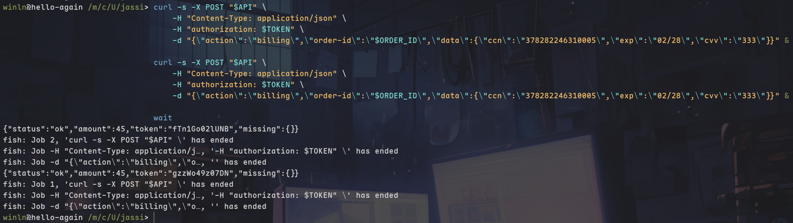
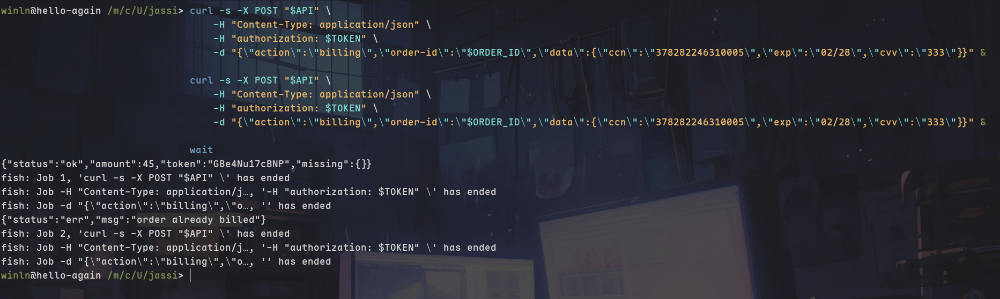

# Bonus Vulnerability#4: Duplicate Billing via Concurrent Replay

## Part 1) Goal and Vulnerability Summary

The DVSA-ORDER-BILLING Lambda allowed the same order to be billed more than once when two billing requests were sent concurrently for the same orderId. The affected component was the billing workflow in order_billing.py. The impact was duplicate successful billing responses, multiple confirmation tokens for one order, and possible duplicate downstream order-processing events. The main weakness was a non-atomic state transition in the billing logic.

## Part 2) Why This Works / Root Cause

The duplicate billing succeeds because the billing Lambda performs the paid-state transition non-atomically. Two concurrent billing requests can both observe the same order as open before either update is committed, so both continue through the successful billing path and enqueue downstream processing. The missing DynamoDB conditional update allows replay and race-condition behavior for the same order ID.

## Part 3) Environment and Setup

API Endpoint: https://76lah627bi.execute-api.us-east-1.amazonaws.com/dvsa/order

Vulnerable Lambda: DVSA-ORDER-BILLING

Database: DVSA-ORDERS-DB

Queue: SQS queue referenced by SQS_URL

Tools used: curl, Linux terminal, AWS Console, CloudWatch Logs, DynamoDB

Authentication: valid user token for the attacker’s own DVSA account

Test order: a fresh unpaid order with shipping completed and ready for billing

## Part 4) Reproduction Steps

Log in to DVSA with a normal user account.

Create a new order and complete the shipping step so the order is ready for billing.

Copy the valid authorization token and the target order ID.

Open a Linux terminal and define:

API="https://76lah627bi.execute-api.us-east-1.amazonaws.com/dvsa/order"

TOKEN="PASTE_YOUR_TOKEN"

ORDER_ID="PASTE_ORDER_ID"

Send two billing requests at nearly the same time for the same order:

curl -s -X POST "$API" \

-H "Content-Type: application/json" \

-H "authorization: $TOKEN" \

-d "{\"action\":\"billing\",\"order-id\":\"$ORDER_ID\",\"data\":{\"ccn\":\"378282246310005\",\"exp\":\"02/28\",\"cvv\":\"333\"}}" &

curl -s -X POST "$API" \

-H "Content-Type: application/json" \

-H "authorization: $TOKEN" \

-d "{\"action\":\"billing\",\"order-id\":\"$ORDER_ID\",\"data\":{\"ccn\":\"378282246310005\",\"exp\":\"02/28\",\"cvv\":\"333\"}}" &

wait

Observe the responses returned by both requests.

Open CloudWatch Logs for DVSA-ORDER-BILLING and inspect the near-simultaneous invocations.

Check the final order record in DynamoDB.

## Part 5) Evidence and Proof

*Figure 35. Duplicate billing confirmed: two concurrent billing requests for the same order both returned success with different confirmation tokens.*

## Part 6) Fix Strategy / Probable Mitigation

The fix was to make the paid-state update conditional and atomic. Instead of performing an unconditional update_item(...), the billing function now updates the order only if its status is still 100 (open). This prevents two concurrent requests from both completing the billing transition. The first request succeeds and changes the order state, while any second request fails the condition and is rejected. This approach keeps the code close to the original design while enforcing safe state transitions at the database level.

## Part 7) Code / Config Changes

### Before fix:

try:

response = table.update_item(

Key=key,

UpdateExpression=update_expression,

ExpressionAttributeValues=expression_attributes

)

# SEND MESSAGE TO SQS

sqs = boto3.client('sqs')

res_sqs = sqs.send_message(

QueueUrl=os.environ["SQS_URL"],

MessageBody=json.dumps({"orderId": orderId, "userId": userId}),

DelaySeconds=10

)

res = {"status": "ok", "amount": float(cartTotal), "token": res['confirmation_token'], "missing": missings}

except:

res = {"status": "err", "msg": "unknown error"}

### After fix

from botocore.exceptions import ClientError

...

try:

expression_attributes[':open_status'] = Decimal(100)

response = table.update_item(

Key=key,

UpdateExpression=update_expression,

ExpressionAttributeValues=expression_attributes,

ConditionExpression='orderStatus = :open_status'

)

# SEND MESSAGE TO SQS

sqs = boto3.client('sqs')

res_sqs = sqs.send_message(

QueueUrl=os.environ["SQS_URL"],

MessageBody=json.dumps({"orderId": orderId, "userId": userId}),

DelaySeconds=10

)

res = {"status": "ok", "amount": float(cartTotal), "token": res['confirmation_token'], "missing": missings}

except ClientError as e:

if e.response['Error']['Code'] == 'ConditionalCheckFailedException':

res = {"status": "err", "msg": "order already billed"}

else:

res = {"status": "err", "msg": "unknown error"}

except:

res = {"status": "err", "msg": "unknown error"}

## Part 8) Verification After Fix

*Figure 36. Post-fix verification: one concurrent billing request succeeded, while the second was rejected with order already billed, confirming the duplicate billing issue was fixed.*

## Part 9) Structured Operation and Security Analysis

Table A. Intended Logic and Exploit Behavior

| Vulnerability | Intended Rule(s) | Artifacts Used | Normal Behavior Evidence | Exploit Behavior Evidence |
| --- | --- | --- | --- | --- |
| Bonus #4: Duplicate Billing via Concurrent Replay | A single order must be billed at most once. Once payment succeeds, later billing attempts for the same order must be rejected. | order_billing.py, curl replay test, CloudWatch logs, DynamoDB order record | A single billing request for an unpaid order should succeed once and change the order state to paid. | Before the fix, two billing requests for the same order both succeeded, showing that the order could be billed twice. After the fix, one request succeeded and the second was rejected with order already billed. |

Table B. Deviation Analysis and Fix

| Vulnerability | Why This Is a Deviation | Deviation Class | Fix Applied (Where) | Post-Fix Verification |
| --- | --- | --- | --- | --- |
| Bonus #4: Duplicate Billing via Concurrent Replay | The same order could be accepted more than once because the billing process checked the order first and updated it later without proper protection. This breaks the rule that an order should only be charged once. | Intentional misuse / security-relevant abuse | DVSA-ORDER-BILLING in order_billing.py: added a DynamoDB ConditionExpression so the update succeeds only if orderStatus is still 100. | The same concurrent replay test now results in one success and one rejection. Duplicate billing no longer succeeds. |

## Part 10) Takeaway / Lessons Learned

Payment workflows must use atomic state transitions. In distributed serverless systems, checking a value in code and updating it later is not enough when two requests can race each other. By moving the protection into the DynamoDB write itself with a conditional update, the billing workflow now enforces that an order can move from open to paid only once. This reduces replay risk and prevents duplicate billing behavior.
