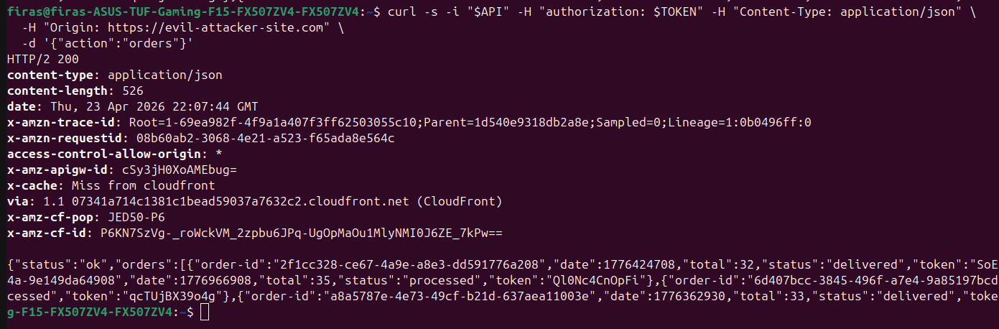
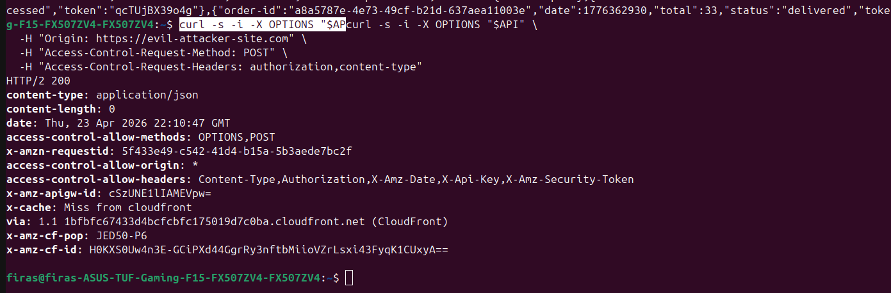
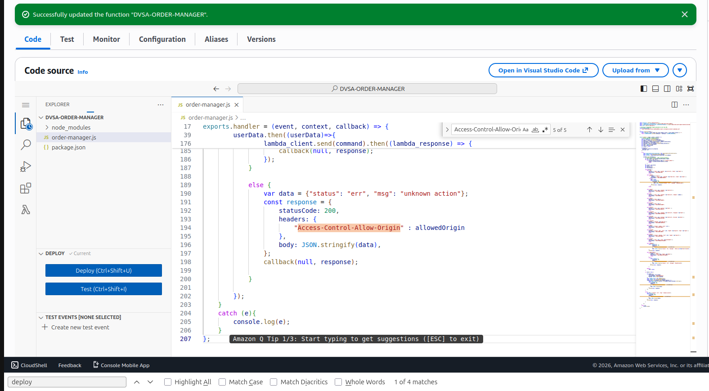
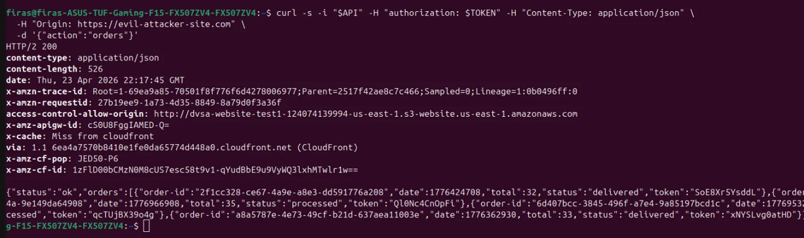
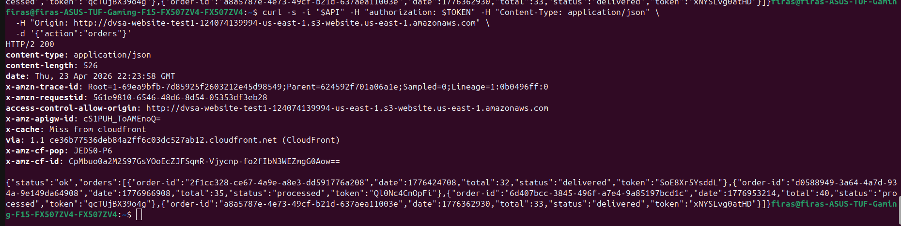

# Bonus Vulnerability #6: Overly Permissive CORS Configuration.

## Part 1) Goal and Vulnerability Summary

DVSA's API Gateway and every Lambda response return Access-Control-Allow-Origin: *, permitting any web origin to send credentialed requests to the API. Combined with Access-Control-Allow-Headers: Authorization, this means a malicious website can, given a user's JWT or a social-engineering pretext, read and modify that user's DVSA data from arbitrary domains. Affected components: order-manager.js (5 hardcoded "*" instances) and the API Gateway CORS definition in template.yml.

## Part 2) Why This Works / Root Cause

The wildcard * in Access-Control-Allow-Origin disables the Same-Origin Policy for this API. Browsers normally block JavaScript on evil.com from reading responses from dvsa-api.com. But when the server explicitly says "any origin allowed," the browser relays the response to the attacker's script. Because the API also permits the Authorization header and the POST method via preflight, credentialed requests are fully enabled. There is no origin validation anywhere in the request path.

## Part 3) Environment and Setup

API endpoint: https://76lah627bi.execute-api.us-east-1.amazonaws.com/dvsa/order

Vulnerable file: backend/functions/order-manager/order-manager.js (5 occurrences of "Access-Control-Allow-Origin": "*")

Also: template.yml Globals.Api.Cors.AllowOrigin: "'*'"

Legitimate frontend origin: http://dvsa-website-test1-124074139994-us-east-1.s3-website.us-east-1.amazonaws.com

Tools: curl

## Part 4) Reproduction Steps

Send an authenticated POST with a fake attacker origin:

curl -s -i "$API" -H "authorization: $TOKEN" -H "Content-Type: application/json" \

-H "Origin: https://evil-attacker-site.com" \

-d '{"action":"orders"}'

Send the CORS preflight a browser would send before a cross-origin request:

curl -s -i -X OPTIONS "$API" \

-H "Origin: https://evil-attacker-site.com" \

-H "Access-Control-Request-Method: POST" \

-H "Access-Control-Request-Headers: authorization,content-type"

The response confirms `access-control-allow-origin: *`, `access-control-allow-methods: OPTIONS,POST`, and `access-control-allow-headers: Content-Type,Authorization,...`  Every piece needed for a cross-origin credentialed POST

## Part 5) Evidence and Proof

*Figure 61. Response headers to a request from Origin: https://evil-attacker-site.com/. API Gateway returns access-control-allow-origin: * and a 200 body containing the user's orders. Any origin is permitted to read sensitive API responses, no origin restriction exists.*

*Figure 62. OPTIONS preflight response showing API Gateway explicitly permits any origin (access-control-allow-origin: *), the POST method (access-control-allow-methods), and the Authorization header (access-control-allow-headers). A browser on any malicious domain can successfully send authenticated POST requests to the DVSA API.*

## Part 6) Fix Strategy / Probable Mitigation

Replace the wildcard with an allowlist of legitimate origins and echo back only the request's origin if it matches. In order-manager.js, introduce an ALLOWED_ORIGINS array and a pickOrigin() helper that returns the request origin when it is on the allowlist or falls back to the canonical site otherwise. Replace every "Access-Control-Allow-Origin": "*" with "Access-Control-Allow-Origin": allowedOrigin. The template.yml CORS config should be updated in the same way so API Gateway's own CORS responses also stop returning *.

## Part 7) Code / Config Changes

File: DVSA-ORDER-MANAGER/order-manager.js

Before (vulnerable):

headers: { "Access-Control-Allow-Origin": "*" }    // x5 occurrences

After (patched):

const ALLOWED_ORIGINS = [

"http://dvsa-website-test1-124074139994-us-east-1.s3-website.us-east-1.amazonaws.com"

];

function pickOrigin(event) {

const reqOrigin = (event.headers && (event.headers.origin || event.headers.Origin)) || "";

return ALLOWED_ORIGINS.includes(reqOrigin) ? reqOrigin : ALLOWED_ORIGINS[0];

}

exports.handler = (event, context, callback) => {

const allowedOrigin = pickOrigin(event);

...

headers: { "Access-Control-Allow-Origin": allowedOrigin }    // all 5 occurrences

...

};

*Figure 63. DVSA-ORDER-MANAGER Lambda after deploying the patched order-manager.js. The ALLOWED_ORIGINS allowlist and pickOrigin() helper replace the hardcoded wildcard, and every response header now uses allowedOrigin (visible on line 194).*

## Part 8) Verification After Fix

After redeploy, the same attacker-origin request returns access-control-allow-origin: http://dvsa-website-test1-... The legitimate site only, not the attacker's domain.

*Figure 64. Post-fix response to a request from Origin: https://evil-attacker-site.com/. The server now returns access-control-allow-origin: http://dvsa-website-test1-...s3-website...amazonaws.com/  The legitimate DVSA domain only. A browser running on any other origin will block the response as a CORS violation, preventing cross-origin data theft.*

A browser running on evil-attacker-site.com receives a CORS mismatch and cannot read the body. The legitimate DVSA frontend still works: a request with the real origin receives a matching access-control-allow-origin and the orders payload.

*Figure 65. Legitimate flow verification. A request from the real DVSA origin receives a matching access-control-allow-origin header and a successful 200 response containing the user's orders, confirming the fix does not break normal browser usage of the API.*

## Part 9) Structured Operation and Security Analysis

Table A. Intended Logic and Exploit Behavior

| Vulnerability | Intended Rule(s) | Artifacts Used | Normal Behavior Evidence | Exploit Behavior Evidence |
| --- | --- | --- | --- | --- |

| Bonus #6: Overly Permissive CORS | Only the legitimate DVSA frontend origin may read API responses. The server must echo back only an allowlisted origin, never a wildcard. | order-manager.js; template.yml CORS block; curl response headers. | Request from the real DVSA origin succeeds with matching access-control-allow-origin. | Request with Origin: https://evil-attacker-site.com gets access-control-allow-origin: * and the full orders JSON — any cross-origin site can read this. |
| --- | --- | --- | --- | --- |

Table B. Deviation Analysis and Fix

| Vulnerability | Why This Is a Deviation | Deviation Class | Fix Applied (Where) | Post-Fix Verification |
| --- | --- | --- | --- | --- |
| Bonus #6: Overly Permissive CORS | The wildcard disables the Same-Origin Policy; any malicious website can read user data cross-origin with a valid token. | Accidental misconfiguration | order-manager.js: ALLOWED_ORIGINS allowlist and pickOrigin() helper; replace all 5 hardcoded "*" with allowedOrigin. | Attacker origin now receives the legitimate site's origin (which browsers reject as a CORS mismatch); legitimate origin continues to work. |

## Part 10) Takeaway / Lessons Learned

Access-Control-Allow-Origin: * is the CORS equivalent of chmod 777, convenient during development, a serious security hole in production. Wildcard CORS on an authenticated API means that any site the user visits while logged in can steal their data. An allowlist of specific origins plus reflection-based header logic is the only correct pattern. The fix is cheap, and it must be applied at every return path, a single missed response can defeat the whole protection.
