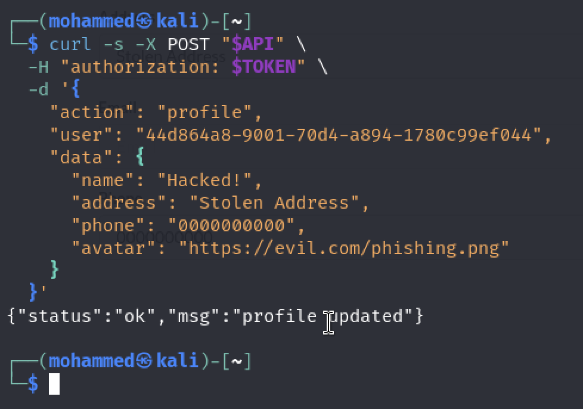
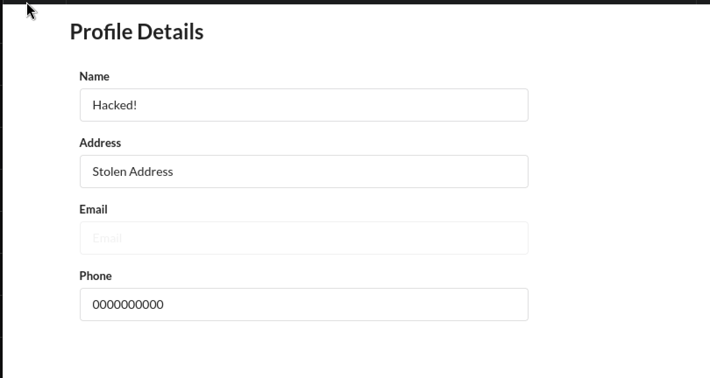
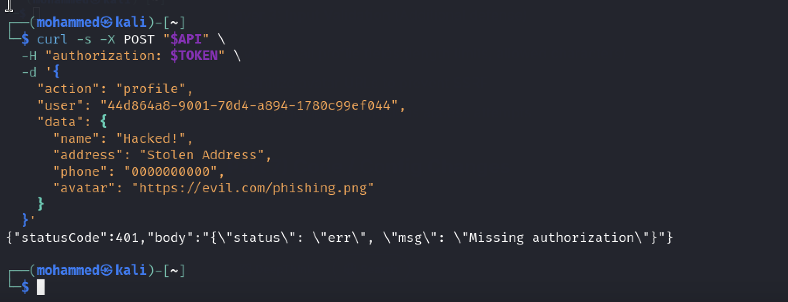

# Bonus Vulnerability #8: Insecure Direct Object Reference (IDOR) in Profile Update

## Part 1) Goal and Vulnerability Summary

This IDOR happens when the profile update Lambda accepts a user input “user” parameter without verifying that it matches the authenticated user from the JWT token.

## Part 2) Why This Works / Root Cause

This vulnerability exists because the DVSA-USER-PROFILE blindly trusts the “user” field from the request body without any verification or authorization, it extracts it directly from the event object:

userId = event[“user”]

## Part 3) Environment and Setup

API Endpoint: https://76lah627bi.execute-api.us-east-1.amazonaws.com/dvsa/order

Vulnerable Lambda: DVSA-USER-PROFILE

Tools: curl command line tool, valid JWT token for any user account

The victim’s or anyone’s account to check the changes

## Part 4) Reproduction Steps

Register 2 different accounts attacker & victim (optional if you assumed that the JWT for the attacker is for the victim)

Obtain user id from the JWT after decoding it using website like jwt.io

Send the curl command

[“user”]s sld user ID

curl -s -X POST "$API" \

-H "Content-Type: application/json" \

-H "authorization: $ATTACKER_TOKEN" \

-d '{

"action": "profile",

"user": "44d864a8-9001-70d4-a894-1780c99ef044",

"data": {

"name": "HACKED BY ATTACKER",

"address": "Stolen Address",

"phone": "0000000000",

"avatar": "https://evil.com/phishing.png"

}  }' | jq

## Part 5) Evidence and Proof

*Figure 68. IDOR exploit evidence showing a profile update request that supplies another user's id in the user field.*

*Figure 69. Victim profile evidence showing unauthorized profile data changed through the vulnerable workflow.*

## Part 6) Fix Strategy / Probable Mitigation

The fix is to implement server-side authorization with 2 steps:

Extract authentication user from the JWT token

Never trust user’s input

JWT is signed by Cognito and never can be forged by attacker

Enforce user match between requested user id and authenticated user id

## Part 7) Code / Config Changes

import json

import boto3

import os

def lambda_handler(event, context):

try:

# Extract user from token

headers = event.get("headers", {})

auth_header = headers.get("Authorization") or headers.get("authorization")

if not auth_header:

return {

"statusCode": 401,

"body": json.dumps({"status": "err", "msg": "Missing authorization"})

}

# Decode JWT payload

token = auth_header.replace("Bearer ", "")

import base64

payload_b64 = token.split('.')[1]

# Add padding

payload_b64 += "=" * (4 - len(payload_b64) % 4)

payload = json.loads(base64.b64decode(payload_b64).decode('utf-8'))

authenticated_user_id = payload.get('sub') or payload.get('username')

if not authenticated_user_id:

return {

"statusCode": 401,

"body": json.dumps({"status": "err", "msg": "Invalid token"})

}

# Parse body safely

body = {}

if 'body' in event:

if isinstance(event['body'], str):

body = json.loads(event['body'])

else:

body = event['body']

requested_user_id = body.get('user', authenticated_user_id)

if requested_user_id != authenticated_user_id:

return {

"statusCode": 403,

"body": json.dumps({

"status": "err",

"msg": "Cannot modify another user's profile"

})

}

# from here on, this is the original code

userId = authenticated_user_id

userData = body.get('profile', {})

if not userData:

return {

"statusCode": 400,

"body": json.dumps({"status": "err", "msg": "Missing profile data"})

}

avatar = userData.get("avatar")

if avatar is None:

avatar = "https://i.imgur.com/tAmofRW.png"

# Original empty string handling

for item in userData:

if userData[item] == "":

userData[item] = " "

dynamodb = boto3.resource('dynamodb')

table = dynamodb.Table(os.environ.get("USERS_TABLE", "DVSA-USERS-TABLE"))

update_expr = 'SET fullname = :fullname, address = :address, phone = :phone, avatar = :avatar'

response = table.update_item(

Key={"userId": userId},

UpdateExpression=update_expr,

ExpressionAttributeValues={

':fullname': userData.get('name', ''),

':address': userData.get('address', ''),

':phone': userData.get('phone', ''),

':avatar': avatar

}

)

if response['ResponseMetadata']['HTTPStatusCode'] == 200:

res = {"status": "ok", "msg": "profile updated"}

else:

res = {"status": "err", "err": "could not update profile"}

return res

except Exception as e:

import traceback

print(traceback.format_exc())

return {"status": "err", "msg": "Internal server error"}

## Part 8) Verification After Fix

*Figure 70. Post-fix verification showing cross-user profile modification is rejected after server-side authorization checks.*

## Part 9) Structured Operation and Security Analysis

### Table A. Intended Logic and Exploit Behavior

| Vulnerability | Intended Rule(s) | Artifacts Used | Normal Behavior Evidence | Exploit Behavior Evidence |
| --- | --- | --- | --- | --- |
| Bonus #8: IDOR | Users should modify only their own profile. The server must verify that the requested user id matches the one coming from the backend | Profile update lambda, JWT token, curl & API endpoint | User A updates his own profile with user: user-A-id, the update succeeds and only user A can see the changes and also user A can’t modify anyone’s data. | The attacker sends milisious request with his own JWT token but with victim’s id instead of his id. The vulnerable function accepts it and change the victimes data |

### Table B. Deviation Analysis and Fix

| Vulnerability | Why This Is a Deviation | Deviation Class | Fix Applied (Where) | Post-Fix Verification |
| --- | --- | --- | --- | --- |
| Bonus #8: IDOR | Bceause the lambda trusts user input (could be attacker) instead of extracting it from the JWT token. | Missing authorization | DVSA-USER-PROFILE: added JWT decoding to extract authenticated user ID. Adding authorization check to compare requested user ID with authenticated user ID. | After the fix, the same payload returns status: err with HTTP 403. Just legitimate profile updates contiue to work. |

## Part 10) Takeaway / Lessons Learned

The main takeaway and as many other lessons, is that to not trust any data coming from the user. Simply because the data could be sent with milisious intend.
